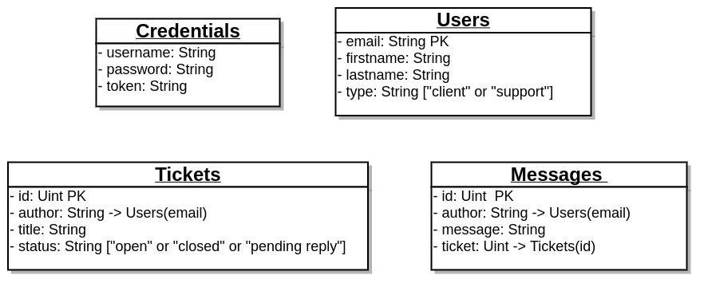

# technical-test-golang

## Context

This application is part of a technical exercice for an internship interview.

## Get started

### Env variables

|      Variable     |      Mandatory     |
|:-----------------:|:------------------:|
| DATABASE_NAME     |         YES        |
| DATABASE_PORT     |         YES        |
| DATABASE_HOST     |         YES        |
| DATABASE_USER     |         YES        |
| DATABASE_PASSWORD |         YES        |
| PORT              | NO (Default: 8080) |


```bash
# Get all dependencies
make deps

# Build
make build

# Build for linux
make build-linux

# Run
make run
```


## Database schema



## API Doc

[Postman API documentation](https://documenter.getpostman.com/view/3951542/RWEZSiKK)

